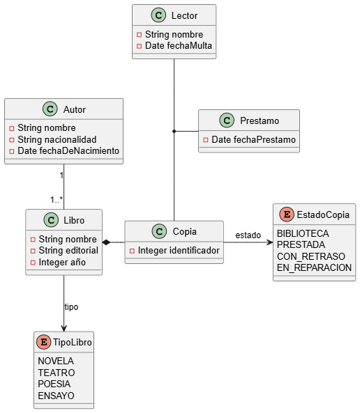

# PROYECTO EJEMPLO DE MAVEN

# GESTION DE BIBLIOTECAS

- una **biblioteca** _tiene_ **copia** de libros.

- los autores se caraterizan por su nombre.

- cada copia _tiene_ un **identificador**.

- los lectores pueden _tener_ un maximo de 3 libros **prestados**.

- realiza diagramas de clases y añade los metodos necesarios para realizar el prestamo y devolucion de los **libros**.

## MODELO DE DATOS

